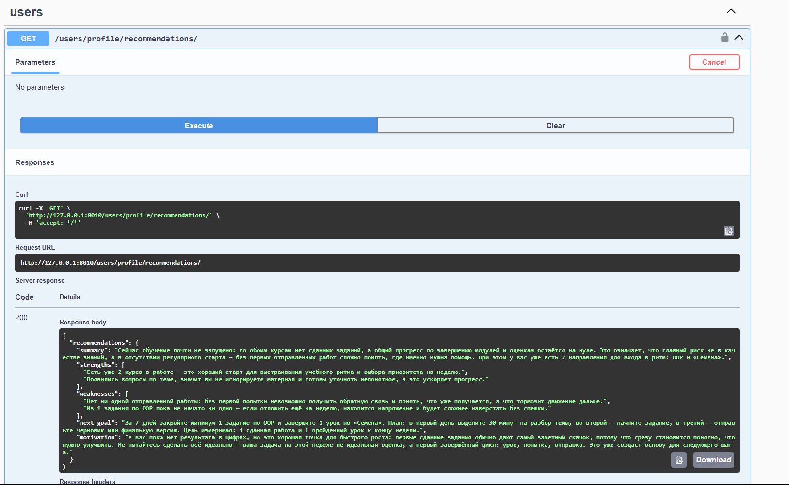
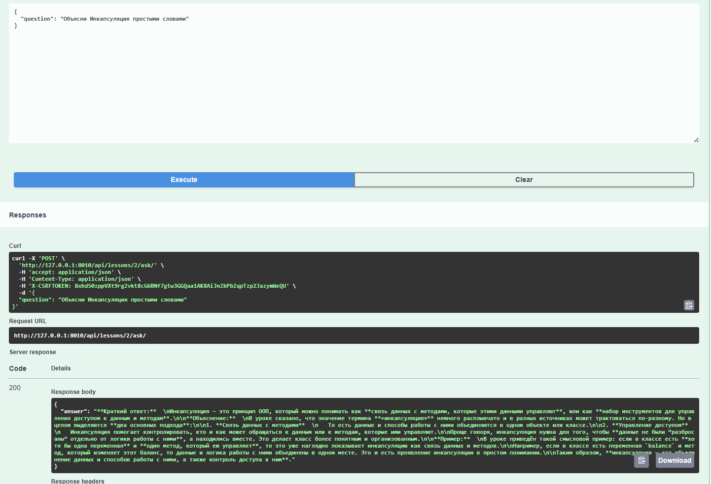

# 🎓 LearnHub

> Современная платформа для онлайн-обучения с гибкой системой ролей

[](https://www.python.org/downloads/)
[](https://www.djangoproject.com/)
[](https://www.django-rest-framework.org/)

---

## 📖 О проекте

**LearnHub** — это RESTful API образовательной платформы, которая сочетает классические возможности LMS (курсы, уроки, задания и роли пользователей) с AI-функциями. Студенты могут задавать вопросы по материалу уроков и получать персональные рекомендации, сформированные на основе их прогресса, оценок и активности.

### Основные возможности
- **JWT Authentication** - Авторизация с помощью токенов
- **Управление курсами** - создание, редактирование, публикация курсов
- **Ролевая система** - INSTRUCTOR, TEACHING_ASSISTANT, STUDENT, OBSERVER
- **Управление уроками** - структурированные материалы курса
- **Домашние задания** - создание, сдача и проверка работ
- **Тесты** - автоматизированное тестирование
- **Уведомления** - интеграция с Telegram для напоминаний
- **Аналитика** - статистика прогресса студентов

---
## 🤖 AI Возможности
LearnHub интегрирует OpenAI для предоставления персонализированной помощи в обучении в качестве универсального чат-бота.

### 📚 AI Помощник в обучении

Студент может задать вопрос по уроку

AI Ассистент:
- Отвечает, используя только content урока;
- Не выдумывает информацию;

### 📈 AI Learning Recommendations
AI Ассистент анализирует прогресс обучения студента и дает рекомендации

AI Использует:
- course progress # Общий прогресс по курсу
- pending_assignments # Количество выполняемых дз
- completion_rate # Процент завершения курса
- recent_questions # Последние 5 вопросов студента по занятиям
- last_grades # Последние 5 отметок студента

Базируясь этой информацией AI генерирует ответ:
- summary # Анализ успеваемости: что хорошо, где проблемы
- strengths # Конкретное достижение с цифрами
- weaknesses # Конкретная проблема с объяснением почему это важно
- next_goal # Конкретная измеримая цель на неделю
- motivation # Персональное мотивирующее сообщение на основе реальных достижений

---

## 📸 Скриншоты

### AI-рекомендации


---

### AI-помощник по урокам


---

## 🔐 Authentication
API использует JWT-аутентификацию.

Основные эндпоинты:

- POST /api/auth/token/
- POST /api/auth/token/refresh/

---
## 🏗️ Технологический стек

### Backend
- **Python 3.11+**
- **Django 5.0+** - веб-фреймворк
- **Django REST Framework** - API
- **PostgreSQL** - основная база данных
- **Redis** - кэширование и брокер сообщений
- **Celery** - асинхронные задачи
- **pytest** - тестирование


### Интеграции
- **Telegram Bot API** - уведомления пользователям
- **drf-spectacular** - автоматическая документация API (OpenAPI/Swagger)
- **openai** - Интеграция AI

---

## 📋 Требования

- Python 3.11 или выше
- PostgreSQL 14+
- Redis 5+
- pip или uv и virtualenv

---

## ⚙️ Установка и запуск

### 1. Клонирование репозитория

```bash
git clone https://github.com/SaidIsakov/LearnHub.git
cd LearnHub
```

### 2. Создание виртуального окружения

```bash
python -m venv venv
source venv/bin/activate  # для Linux/macOS
# или
venv\Scripts\activate  # для Windows
```

### 3. Установка зависимостей

```bash
pip install -r requirements.txt
```

### 4. Настройка переменных окружения

Создайте файл `.env` в корне проекта:

```env
# Django
SECRET_KEY=your-secret-key-here
DEBUG=True

# Database
DB_NAME=learnhub_db
DB_USER=postgres
DB_PASSWORD=your_password
DB_HOST=localhost
DB_PORT=5432

# Telegram (опционально)
SOCIAL_AUTH_TELEGRAM_BOT_TOKEN=your_bot_token
TELEGRAM_BOT_TOKEN=your_bot_token
TELEGRAM_CHAT_ID=your_chat_id

# OpenAI
OPENAI_API_KEY=your_openai_api_key
```

### 5. Применение миграций

```bash
cd backend
python manage.py migrate
```

### 6. Создание суперпользователя

```bash
python manage.py createsuperuser
```

### 7. Запуск сервера разработки

```bash
python manage.py runserver
```

API будет доступно по адресу: `http://localhost:8010/api/`

### 8. Запуск Celery (опционально)

```bash
# В отдельном терминале
celery -A conf worker -l info

# Для периодических задач
celery -A conf beat -l info
```

---

## 📚 API Документация

После запуска сервера документация доступна по адресам:

- **Swagger UI**: http://localhost:8010/api/schema/swagger-ui/
- **ReDoc**: http://localhost:8010/api/schema/redoc/
- **OpenAPI Schema**: http://localhost:8010/api/schema/

---

## 🧪 Тестирование

Запуск всех тестов:

```bash
pytest
```

Запуск конкретного модуля:

```bash
pytest apps/courses/tests/
```

---

## 📁 Структура проекта

```
learnhub/
├── backend/
│   ├── apps/
│   │   ├── courses/          # Управление курсами
│   │   │   ├── models.py     # Course, CourseMember, Lesson, CourseRole, ChatMessage
│   │   │   ├── views.py      # ViewSets для API
│   │   │   ├── serializers.py
│   │   │   ├── permissions.py # Права доступа
│   │   │   ├── tests/
│   │   │   ├── services.py # бизнес-логика
│   │   │   ├── tasks.py # асинхронные задачи
│   │   │   └── telegram.py # интеграция с телеграм
│   │   ├── assignments/      # Домашние задания (в разработке)
│   │   └── users/            # Пользователи
│   ├── conf/                 # Настройки проекта
│   │   ├── settings.py
│   │   ├── urls.py
│   │   └── celery.py
│   ├── manage.py
│   └── conftest.py           # Фикстуры для pytest
├── requirements.txt
├── .env.example
├── .gitignore
└── README.md
```

---

## 🔐 Роли и права доступа

| Действие | INSTRUCTOR | TEACHING_ASSISTANT | STUDENT | OBSERVER |
|----------|------------|-------------------|---------|----------|
| Создать курс | ✅ | ❌ | ❌ | ❌ |
| Редактировать курс | ✅ | ❌ | ❌ | ❌ |
| Удалить курс | ✅ | ❌ | ❌ | ❌ |
| Создать урок | ✅ | ✅ | ❌ | ❌ |
| Редактировать урок | ✅ | ✅ | ❌ | ❌ |
| Просмотр материалов | ✅ | ✅ | ✅ | ✅ |
| Создать задание | ✅ | ✅ | ❌ | ❌ |
| Сдать задание | ❌ | ❌ | ✅ | ❌ |
| Проверить задание | ✅ | ✅ | ❌ | ❌ |
| Просмотр оценок (своих) | ✅ | ✅ | ✅ | ❌ |
| Просмотр оценок (всех) | ✅ | ✅ | ❌ | ❌ |

## 👤 Автор

**Said**

- GitHub: [@SaidIsakov](https://github.com/SaidIsakov)
- Email: pm5581287@gmail.com

**⭐ Если проект был полезен, поставьте звёздочку!**
